

  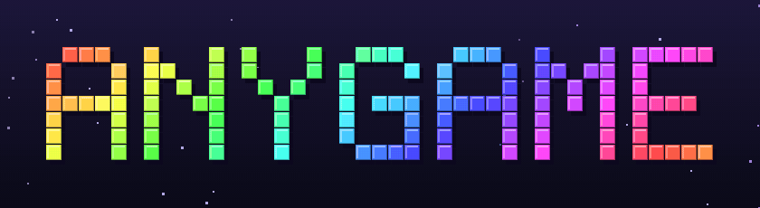

  игры прямо в telegram — без установки, в одно касание 
  <a href="https://t.me/anygametg_bot"><b>▶ играть в @anygametg_bot</b></a>

## игры

<table>
  <tr>
    <td align="center" width="33%">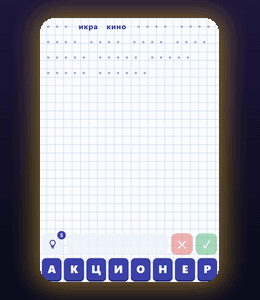 <b>слова из слова</b> собери слова из букв длинного слова</td>
    <td align="center" width="33%">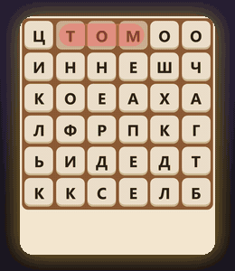 <b>филворд</b> найди спрятанные слова на поле</td>
    <td align="center" width="33%">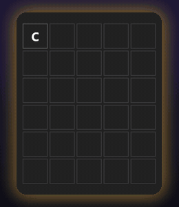 <b>wordle</b> угадай слово за шесть попыток, en / ua / ru</td>
  </tr>
  <tr>
    <td align="center">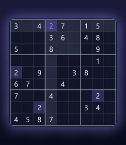 <b>судоку</b> четыре сложности и подсказки с объяснением</td>
    <td align="center">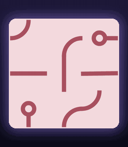 <b>петля</b> крути плитки, пока всё не замкнётся</td>
    <td align="center">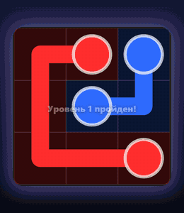 <b>соедини точки</b> соедини пары и заполни всё поле</td>
  </tr>
  <tr>
    <td align="center">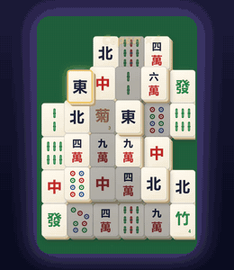 <b>маджонг</b> снимай пары свободных плиток</td>
    <td align="center">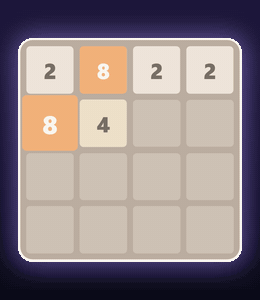 <b>2048</b> сливай плитки до 2048 и дальше</td>
    <td align="center">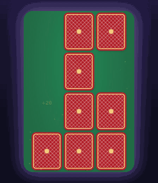 <b>мемори</b> найди все пары, пока есть жизни</td>
  </tr>
  <tr>
    <td align="center">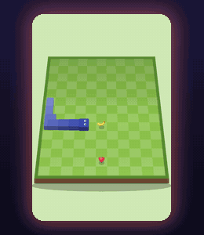 <b>змейка</b> классика и уровни с ловушками</td>
    <td align="center">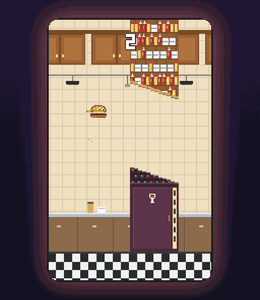 <b>flappy burger</b> лети бургером через кухню и ночную улицу</td>
    <td align="center">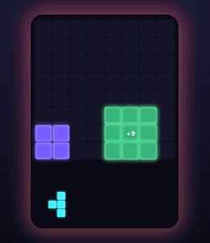 <b>block blast</b> ставь фигуры и сжигай линии</td>
  </tr>
  <tr>
    <td align="center">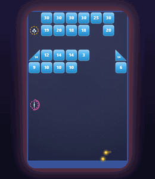 <b>brick blast</b> сотня шариков против блоков</td>
    <td align="center">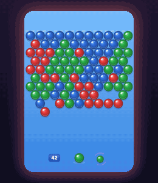 <b>шарики</b> лопай тройки одного цвета</td>
    <td align="center">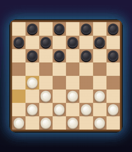 <b>шашки</b> русские шашки и поддавки против бота</td>
  </tr>
  <tr>
    <td align="center">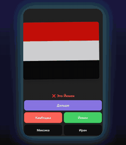 <b>флаги</b> угадай страну по флагу</td>
    <td align="center">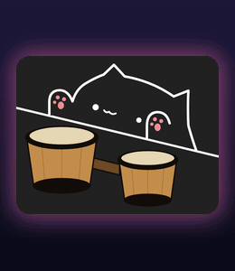 <b>bongo cat</b> кот стучит, а ты играешь мелодии</td>
    <td align="center">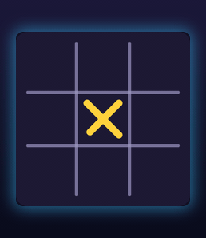 <b>крестики-нолики</b> классика 3×3 и гомоку против бота</td>
  </tr>
  <tr>
    <td align="center">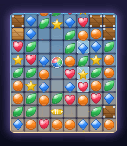 <b>три в ряд</b> меняй фишки местами и собирай ряды</td>
    <td align="center">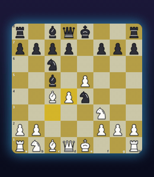 <b>шахматы</b> семь уровней бота или партия с другом по ссылке</td>
    <td align="center">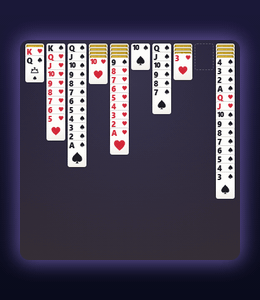 <b>паук</b> пасьянс на одну, две или четыре масти</td>
  </tr>
  <tr>
    <td align="center">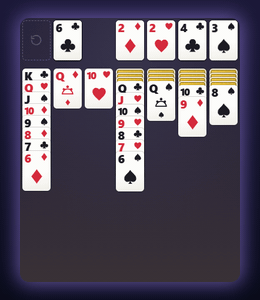 <b>косынка</b> сдача по одной или по три карты</td>
    <td align="center">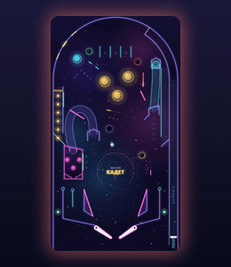 <b>пинбол</b> флипперы, бамперы и миссии</td>
    <td align="center">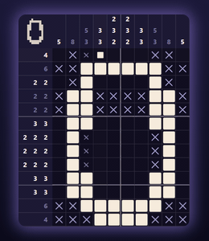 <b>японский кроссворд</b> закрашивай клетки по числам и открывай картинку</td>
  </tr>
  <tr>
    <td align="center">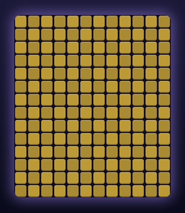 <b>сапёр</b> открывай клетки и не задень мину</td>
    <td align="center">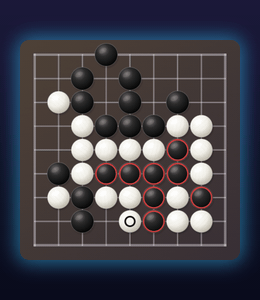 <b>го</b> доски 9, 13 и 19 против бота</td>
    <td align="center">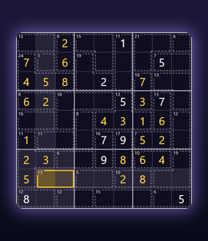 <b>судоку-киллер</b> судоку с клетками-суммами</td>
  </tr>
  <tr>
    <td align="center">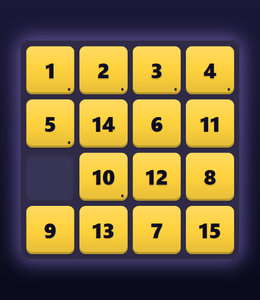 <b>пятнашки</b> собери плитки по порядку, поля от 3×3 до 8×8</td>
    <td align="center">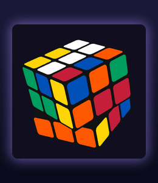 <b>кубик рубика</b> крути грани и собери кубик</td>
    <td align="center">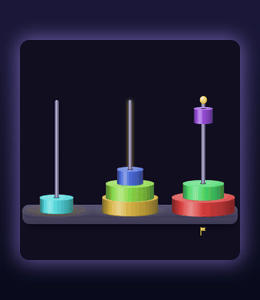 <b>ханойская башня</b> перенеси башню, до десяти дисков</td>
  </tr>
  <tr>
    <td align="center">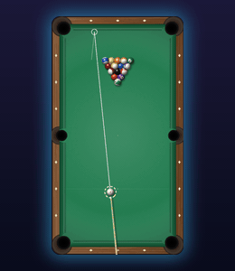 <b>бильярд</b> пул-«восьмёрка» с настоящей физикой</td>
    <td align="center">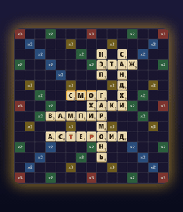 <b>эрудит</b> скрэббл на русском против бота</td>
    <td align="center">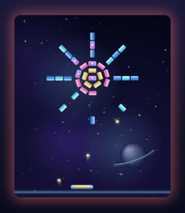 <b>арканоид</b> 300 уровней и 15 бонусов</td>
  </tr>
  <tr>
    <td align="center">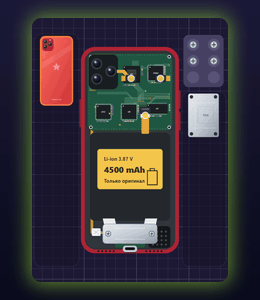 <b>ремонт гаджетов</b> найди поломку, разбери и почини</td>
    <td align="center">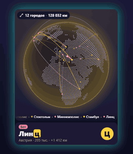 <b>города</b> города против бота, маршрут на глобусе</td>
    <td align="center">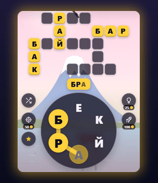 <b>круг слов</b> веди по буквам — слова встают в кроссворд</td>
  </tr>
  <tr>
    <td align="center">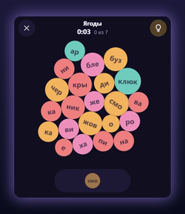 <b>слоги</b> собери слова из слогов-кружков, 56 тем</td>
    <td align="center">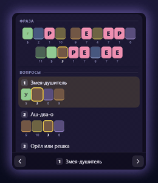 <b>кростик</b> вопросы открывают спрятанную фразу, 600 уровней</td>
    <td align="center">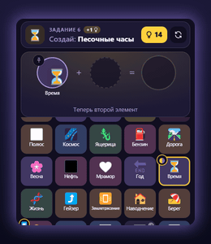 <b>алхимия</b> вода + огонь = пар, 1100 элементов</td>
  </tr>
  <tr>
    <td align="center">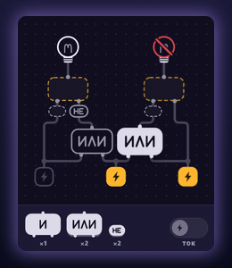 <b>логические схемы</b> расставь и, или, не — и лампа загорится</td>
  </tr>
</table>

## что есть

- 40 игр: слова, головоломки, аркады, настольные, викторина и музыка
- рейтинг по каждой игре, видно только имя
- прогресс сохраняется за аккаунтом telegram, можно играть с любого устройства
- звуки, скины, светлая и тёмная тема
- `/report` в боте — идеи и баги прямо мне

## как устроено

- чистый js без фреймворков, каждая игра — отдельный модуль
- сервер — cloudflare workers и d1, вход по подписи telegram
- сайт — github pages

## лицензия

все права защищены, код открыт только для просмотра. подробности — в [LICENSE](LICENSE) ([на русском](LICENSE.ru.md)).
